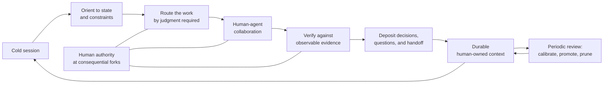

# Personal AI OS

> A private operating system for high-agency, durable collaboration with AI agents.

**Selected project · Human–AI collaboration · Agent operations · Context architecture**

This repository is a public architecture case study of my personal AI operating system. It explains how I work with agents across real projects without publishing the private corpus, instructions, history, or personal material that powers it.

## Why I built it

AI models are powerful but discontinuous collaborators. Sessions end, context disappears, model capability changes, and confident completion can be easier to produce than demonstrated completion. A chat history alone does not solve that problem; it preserves conversation, not necessarily judgment.

I built Personal AI OS so the collaboration itself can improve over time. Decisions retain their reasons. Open questions survive context resets. Agent disagreement becomes calibration data. Repeated corrections can become reusable operating rules. Useful procedures are promoted only after they prove themselves under real work.

The goal is not maximum automation. The goal is a collaboration in which the agent becomes more useful while my own judgment, authorship, and directing skill become stronger rather than weaker.

## Operating model

The architecture has three parts:

- **Stock** — human-owned, model-legible context that compounds: principles, decisions with reasons, open questions, current state, calibrated predictions, and earned procedures.
- **Loop** — a repeatable session lifecycle: orient, route, collaborate, verify, deposit, and periodically review.
- **Governor** — explicit boundaries for authorship, delegation, dissent, reversibility, privacy, and decisions that must remain human.

This makes continuity independent of any single chat or model. A capable agent can enter cold, load the minimum relevant state, understand how the work is divided, and continue without pretending to remember what it does not.

## How I interact with agents

### I use agents as senior collaborators, not oracles

Agreement has to be earned. The agent is expected to surface the strongest objection, state uncertainty, and distinguish evidence from inference. Automatic deference and performative contrarianism are treated as the same failure in opposite directions.

### I specify outcomes and boundaries before activity

A substantive session begins by naming the objective, what completion looks like, what is out of scope, and which decisions require me. This reduces hidden assumptions without forcing me to micromanage every implementation step.

### I keep judgment and delegate leverage

Research conclusions, core arguments, taste, architecture, and consequential choices stay routed through me. Agents take more of the implementation, long reads, comparison sweeps, transformations, verification, and operational follow-through. Delegation is a contract with bounded scope and explicit completion criteria.

### I require demonstrated completion

“Should work” is not a completion state. Technical work is reproduced before it is changed, retries must change a variable, and finished work carries observable evidence: tests, output, state inspection, or an explicit unverified label.

### I turn disagreement into calibration

Consequential dissent is not lost in the conversation. The claim, confidence, settling observation, and review point are preserved. Later outcomes calibrate both the agent’s judgment and my own without confusing a lucky outcome for a good decision process.

### I let process earn permanence

Session-specific instructions do not silently become permanent policy. A correction that recurs can be proposed as a standing rule. A procedure that repeatedly proves useful can become a reusable skill. Rules and skills that stop affecting behavior are pruned. Subtraction is a sign that the system is learning.

## System responsibilities

| Area | What the OS provides |
|---|---|
| Session continuity | A cold-start orientation and concise handoff state instead of dependence on chat history. |
| Context engineering | Layered, project-scoped context that loads only where it is relevant. |
| Cognitive routing | Explicit division between human judgment, agent judgment, and delegable mechanical work. |
| Agent delegation | Bounded tasks, non-overlapping responsibilities, defined tradeoffs, and verifiable done criteria. |
| Quality control | Reproduction before intervention, evidence-backed completion, and explicit uncertainty. |
| Model routing | Stronger models for judgment and synthesis; cheaper models or subagents for bounded bulk work. |
| Durable memory | Decisions with reasons, unresolved questions, current commitments, and learned corrections. |
| Calibration | Predictions and disagreements revisited against later evidence. |
| Adaptation | Repeated behavior becomes procedure; unused scaffolding is removed during review. |
| Human development | Automation is routed so important human capabilities do not atrophy. |

## Design choices that matter

### Opt-in context, not global personality

The global model remains largely unmodified. Projects opt into the OS when continuity and compounding matter. This keeps unrelated tasks clean and prevents personal context from leaking into every interaction.

### Memory is curated state, not exhaustive history

The system does not try to save everything. It preserves what future work needs: decisions and reasons, open forks, active state, corrections, and procedures with demonstrated value. Raw conversation is not treated as durable knowledge by default.

### Scaffolding follows observed failure

Constraints are added when real work reveals a recurring gap, not because an elaborate agent framework looks impressive. More capable models can operate with less procedure; weaker models inherit explicit checks that preserve reliable behavior.

### Human skill is part of the objective function

A workflow can be efficient while making its operator less capable. The OS therefore routes work partly according to which abilities I want to preserve: reasoning, writing, learning, taste, architecture, and consequential decision-making.

## What this project demonstrates

- Persistent context architecture for stateless AI sessions
- Practical human–agent delegation and control boundaries
- Agent instructions that adapt across model capability levels
- Cross-model integration for Claude Code and Codex
- Reusable agent skills and project-scoped operating rules
- Verification-oriented technical collaboration
- Decision journaling, prediction tracking, and calibration loops
- Privacy-aware memory and context isolation
- Continuous improvement through promotion and pruning
- An operator model for using AI without surrendering authorship

This is not a chatbot wrapper, an agent swarm, or a productivity dashboard. It is a maintained collaboration layer around probabilistic systems, designed to make real work compound across sessions.

## Relationship to Harness Engine

These projects show two sides of my agent-systems work:

- **Personal AI OS** is the operator layer: how I personally direct, challenge, verify, and learn with AI agents across ongoing work.
- **[Harness Engine](https://github.com/PetreLaskov/harness-engine)** is the platform layer: how I design grounded, personalized agent environments as maintainable systems.

One is the lived operating practice; the other is the system-building discipline derived from that practice.

## Public boundary

This showcase intentionally excludes:

- Personal profile, journal, priorities, questions, and current work state
- Conversation history, handoffs, applications, and private project material
- Agent instructions, skill implementations, prompts, and model-specific adapters
- Internal schemas, automation, file layout, and operational commands
- Private repository history, paths, identities, and calibration records

The public repository communicates the architecture and my working method. It is not a distribution of the OS and cannot reconstruct the private system.

## Project status

Personal AI OS is active private infrastructure used across software delivery, research, writing, learning, and business work. It evolves from observed collaboration failures and useful recurring behaviors rather than speculative feature growth.

Built and maintained by [Petre Laskov](https://github.com/PetreLaskov).

---

© 2026 Petre Laskov. Shared for portfolio and evaluation purposes. All rights reserved.
